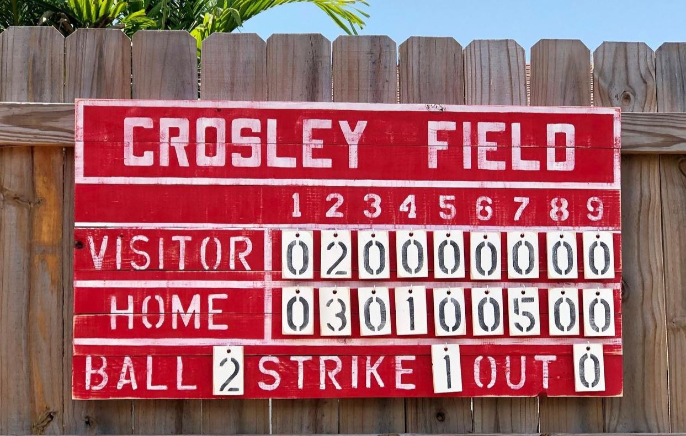
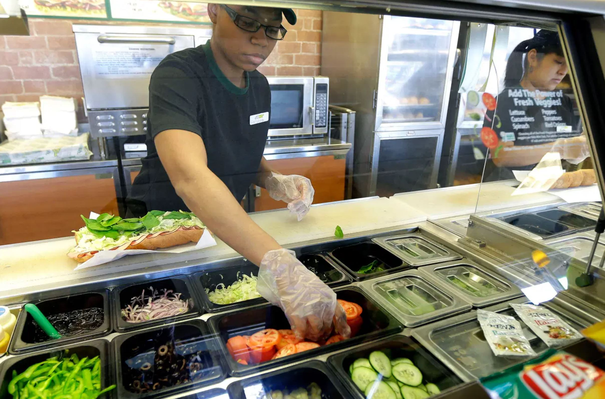

## React as Scoreboard attendant
In baseball, we can display the detailed breakdown of the games current state on a scoreboard. This will include balls, strikes, outs, the score for each team in each inning, and the current inning. In the Olden Days, an attendant would update the scoreboard by manually changing the values.



Each time an event occurs in the game, the scoreboard needs to be updated. Since there's over two dozen separate fields that could be updated, this attendant will be in trouble unless he can figure out the specific parts of the scoreboard to update, and leave the rest of the values of unchanged.  This makes changes quicker, and prevents confusion when the scoreboard is in the state of being updated, which might show up as page jitter on a webpage.

In the following lessons we'll build a baseball scoreboard using two styles: DOM manipulation that we learned in Unit1 vs React Hooks that we learned in Unit2. 

#### Open up both apps
 - Open up the page in `plain-dom` using LiveServer
 - Open up the page in `react-app` by cd'ing into the directroy and running `npm start`

 #### Identical Functionality, Different Styles

## What does React accomplish for us?
 Based on the differences in authoring the app, 
 - HTML can be chuncked and Array Mapping replaces HTML hard-coding or confusing DOM-writing loops. Think of the difference between `document.createElement("li")` style vs. JSX mixed HTML and JS style of building smaller components.
 <br>
 - Event listening / handling gets broken down into hooks and redering. This makes it easy to do multiple re-renders for one event, but limit re-rendering where not needed.

#### Compare the difference in creating dynamic content
Look at a dougie lab dom write code vs some modularized baseball react code (`git diff ff5429 07ddb2`).

<details>
    <summary>Old Style</summary>

```javascript
 for(let i = 0; i < userInput; i++){
          const $descriptor = $('<dd>').attr('class', 'descriptor' + [i]);
          $('.reports').append($descriptor);
          $descriptor.html("INCIDENT: " + data[i].descriptor);
          const $policeButton = $('<button>').attr('class', 'policeButton');
          $policeButton.append('Check Police Response');
          $('.reports').append($policeButton);
          const $allPoliceButtons = $('.policeButton');
          const newText = $('<p>');
          newText.append("POLICE RESPONSE: " + data[i].resolution_description);
          $descriptor.append(newText);
          newText.hide()
          $($allPoliceButtons).eq(i).on('click', (event) => {
            event.preventDefault();
            newText.toggle();
```
</details>

<details>
    <summary>New Style</summary>
```
 <tr class="away score-row">
             <td class="team-name">
                 Away
             </td>
-            <td class="runs 1">0</td>
-            <td class="runs 2">0</td>
-            <td class="runs 3">0</td>
-            <td class="runs 4">0</td>
-            <td class="runs 5">0</td>
-            <td class="runs 6">0</td>
+            {score[1].map((val, index) => (<ScoreSquare scoreValue={val} index={index}/>) )}
```
</details>
#### View the mass re-rendering
Open the `Elements` tab on your developer tools. In the `plain-dom` page, expand the scoreboard elements and then trigger an event. See how they all flash to show they are all updating. Then open the same devtools view with the `react-app` page, and perform an event, and see only very specific items update.

We can see why the plain-dom page updates everything in `git diff 415ef4 3b827`.

<details>
    <summary>DOM manipulation refactor</summary>

```
diff --git a/plain-dom/script.js b/plain-dom/script.js
index bf8b018..978a746 100644
--- a/plain-dom/script.js
+++ b/plain-dom/script.js
@@ -30,31 +30,28 @@ function swingMiss() {
     } else {
         strikes ++
     }
-    updateBalls()
-    updateStrikes()
-    updateOuts()
-    updateInning()
-    updateRuns()
+    
+    updateAll()
 }
 
 function eventOut() {
     incrementOut()
 
-    updateBalls()
-    updateStrikes()
-    updateOuts()
-    updateInning()
-    updateRuns()
+    updateAll()
 }
 
 function homerun() {
     incrementCurrentScore()
     
-    updateBalls()
-    updateStrikes()
-    updateOuts()
-    updateInning()
-    updateRuns()
+    updateAll()
+}
+
+function updateAll() {
+    updateBalls()    // never changes innings, outs
+    updateStrikes()  // never changes runs
+    updateOuts()     // never changes runs
+    updateInning()   // never changes runs
+    updateRuns()     // never changes innings, outs; only needs current inning
 }
```
</details>

## How scalable is each style, in terms of handling increasing complexity?
Let's look at complex web pages and see what would happen if we continued to use simple DOM manipulation to develop the page.


Or


## How extensible is each style?
In the baseball example we already know what we're tying to build: we know what the scoreboard needs to look like (because we already know baseball has 9 innings) and we know exactly how the rules work. How is that similiar and different from building an app for a growing non profit organization or business?

For example do we know how many crypto currencies in total there are? Unlike with baseball, the exact amount isn't known, and constantly evolving.

How modularized is the code? Modularized means one section of the code can change without needing to change other un-related parts of the code. How could this be useful to a product team? To a dev team?

#### Example of extendiblity: what is your use case?
 What are the pros and cons of each of these two methods of maing a sandwich?
 <table>
 <tr>
 <td>
 
 </td>
 <td>
 
 </td>


